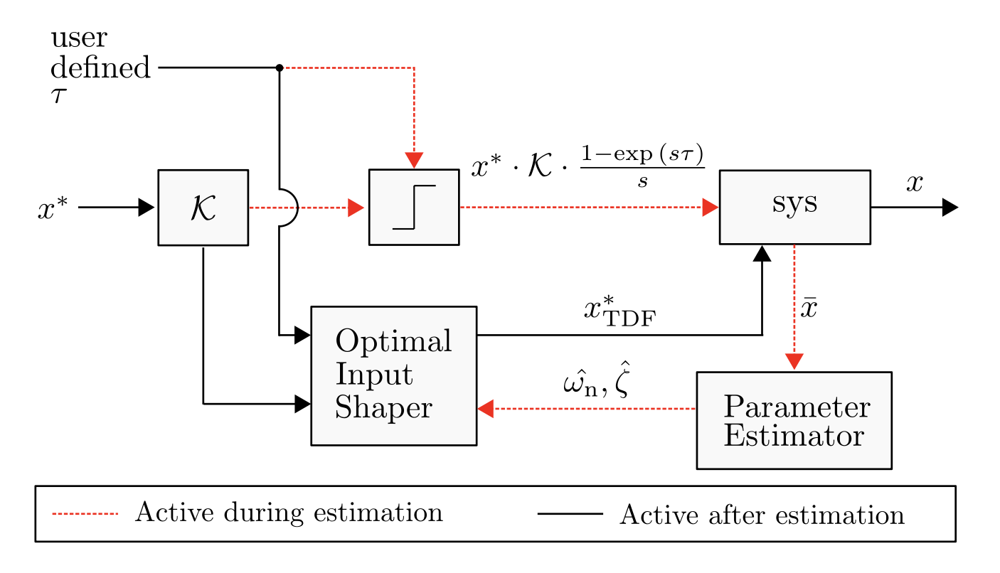
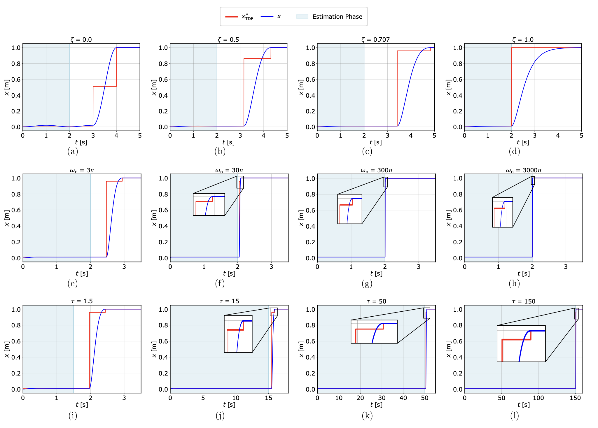
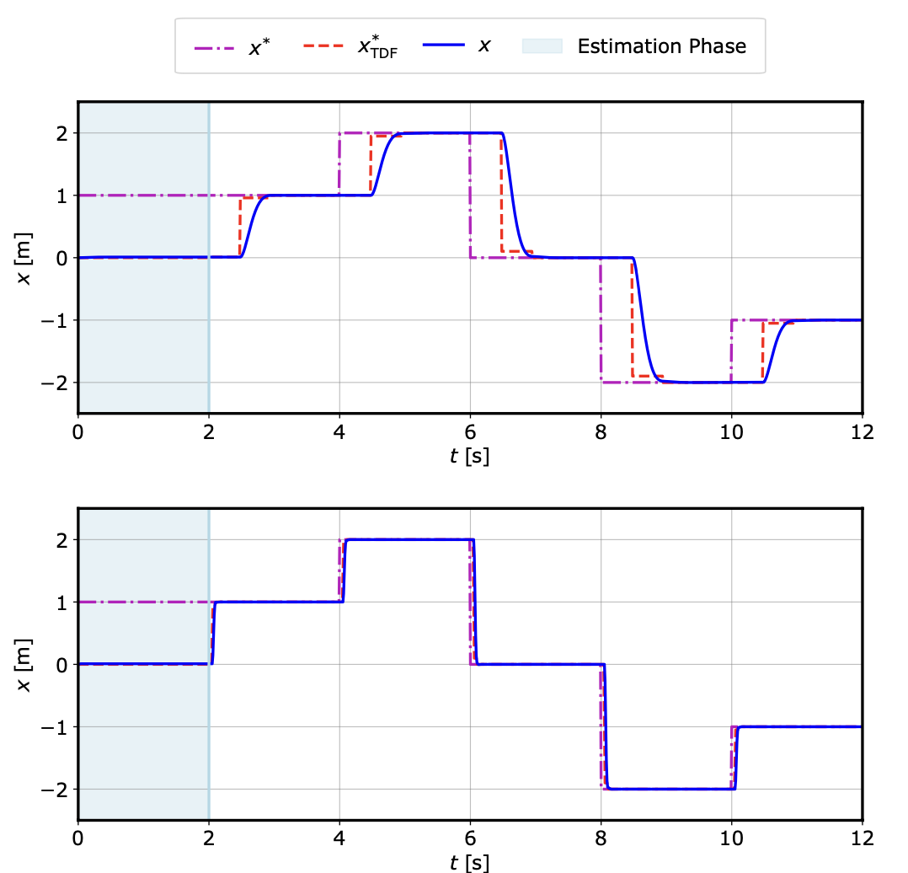
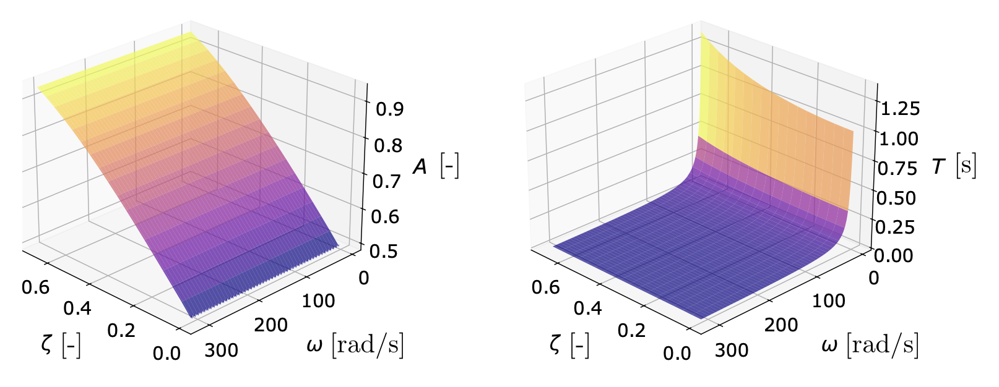

# Adaptive Input Shaper Design for Unknown Second-Order Systems with Real-Time Parameter Estimation

<p align="center">
  
</p>
<p align="center">
  Fig: Feedforward control scheme with parameter estimation and optimal input shaping for vibration suppression
</p>

This work propose a feedforward control method that not only estimates system parameters online for a black-box second- order system, but also designs the input shaper adaptively in real-time. This repostitory contains the code, data, and methods used to design optimal input shaper and parameter estimator. 

*Note: Certain code segments have been omitted due to ongoing manuscript reviews.*

---

## Project Structure

- `SecondOrderSystem.py` – Defines the differential equation of a generic second-order system, given system parameters $\omega_{\mathrm{n}}$ and $\zeta$.
- `Estimator.py` – Implements the estimation algorithm (detailed below).
- `IS_A_T_Calc.py` – Calculates the $\mathcal{A}$ and $\mathcal{T}$ parameters of an input shaper calibrated to the system using $\omega_{\mathrm{n}}$ and $\zeta$.
- `run_adaptive.py` – Runs multiple simulations of the adaptive input shaper across diverse scenarios.
- `aIS_StepWise.py` – Simulates an adaptive input shaper with multiple step-wise changes after the estimation period.
- `Adaptive_IS_3D.py` – Generates 3D surface plots showing the dependency of $\mathcal{A}$ and $\mathcal{T}$ over ranges of $\omega_{\mathrm{n}}$ and $\zeta$.

---

## Requirements

- matplotlib==3.10.3
- numpy==2.3.0
- pandas==2.3.0
- pyDOE==0.3.8
- pyDOE==0.3.8
- scipy==1.15.3
- seaborn==0.13.2

Install dependencies using:

```bash
pip install -r requirements.txt
```
---

## How to Run

### Step 1: Setup

Download or clone the repository:

```bash
git clone https://github.com/NyiNyi-14/Adaptive_Input_Shaper_for_Blackbox_2nd_Order_Sys.git
```

Make sure all scripts are in the same directory.

 ### Step 2: Parameter Customization

Before running the code, adjust the system parameters to configure your simulation:

- **System parameters**: `omega_test`, `zeta_test`  
- **Time values**: `duration`, `identification_duration`, `dt`  

### Step 3: Generate Figures and Tables

Run the main scripts to simulate the system, view results, and generate figures and tables:

```bash
python run_adaptive.py
```
- Simulates the adaptive input shaper’s single-step behavior over a range of $\omega_{\mathrm{n}}$ and $\zeta$ values.  

```bash
python aIS_StepWise.py
```
- Demonstrates optimal input shaper performance for multiple step-wise changes.  

---

## Outputs


**Fig:** Performance of the proposed method:  
- (a–d) Varying $\zeta$ with $\tau = 2 \,\text{s}$ and $\omega_{\mathrm{n}} = \pi \,\text{rad/s}$  
- (e–h) Varying $\omega_{\mathrm{n}}$ with $\tau = 2 \,\text{s}$ and $\zeta = 0.707$  
- (i–l) Varying $\tau$ with $\omega_{\mathrm{n}} = 3\pi \,\text{rad/s}$ and $\zeta = 0.707$  


**Fig:** Feedforward control for step-wise reference tracking:  
- **Top:** $\omega_{\mathrm{n}} = 3\pi \,\text{rad/s}$  
- **Bottom:** $\omega_{\mathrm{n}} = 30\pi \,\text{rad/s}$  


**Fig:** Dependency of input shaper parameters $\mathcal{A}$ and $\mathcal{T}$ on $\zeta$ and $\omega_{\mathrm{n}}$ under parameter sweep.  

---

## Related Work

This project builds on developed control mechanisms, including:

- Design optimal input shaper online
- Real time parameter estimation

---

## Citation

If you use this work, please cite the related paper as follows:

---
<!-- 
## Author

**Nyi Nyi Aung** 

PhD Student, Mechanical and Industrial Engineering - LSU, USA

MSc, Sustainable Transportation and Electrical Power Systems - UniOvi, Spain

BE, Electrical Power - YTU, Myanmar

##

**Bradley Wight** 

B.S. Student, Mechanical Engineering

Louisiana State University

##

**Adrian Stein, PhD**

Assistant Professor

Department of Mechanical and Industrial Engineering

Louisiana State University

## -->
